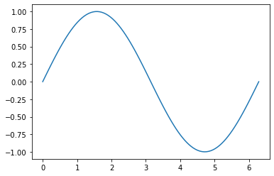
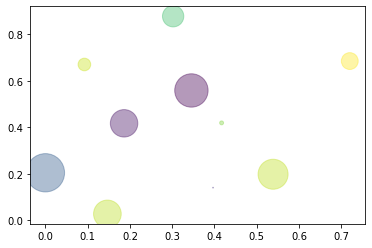

```python
# 设置 inline 方式，直接把图片画在网页上
%matplotlib inline
# 导入必要的库
import numpy as np
import matplotlib.pyplot as plt
# 在 [0, 2*PI] 之间取 100 个点
x = np.linspace(0, 2 * np.pi, num=100)
# 计算这 100 个点的正弦值，并保存在变量 y
y = np.sin(x)
# 画出 x, y 即是我们的正弦曲线
plt.plot(x, y)
```


    [<matplotlib.lines.Line2D at 0x274377d82e0>]


    

    


```python
import numpy as np
import matplotlib.pyplot as plt
np.random.seed(1)
x=np.random.rand(10)
y=np.random.rand(10)
colors=np.random.rand(10)
area=(40 * np.random.rand(10))**2
%matplotlib inline
plt.scatter(x,y,s=area,c=colors,alpha=0.4)
```


    <matplotlib.collections.PathCollection at 0x27437f9c3d0>


    

    


```python
dir(str)
```


    ['__add__',
     '__class__',
     '__contains__',
     '__delattr__',
     '__dir__',
     '__doc__',
     '__eq__',
     '__format__',
     '__ge__',
     '__getattribute__',
     '__getitem__',
     '__getnewargs__',
     '__gt__',
     '__hash__',
     '__init__',
     '__init_subclass__',
     '__iter__',
     '__le__',
     '__len__',
     '__lt__',
     '__mod__',
     '__mul__',
     '__ne__',
     '__new__',
     '__reduce__',
     '__reduce_ex__',
     '__repr__',
     '__rmod__',
     '__rmul__',
     '__setattr__',
     '__sizeof__',
     '__str__',
     '__subclasshook__',
     'capitalize',
     'casefold',
     'center',
     'count',
     'encode',
     'endswith',
     'expandtabs',
     'find',
     'format',
     'format_map',
     'index',
     'isalnum',
     'isalpha',
     'isascii',
     'isdecimal',
     'isdigit',
     'isidentifier',
     'islower',
     'isnumeric',
     'isprintable',
     'isspace',
     'istitle',
     'isupper',
     'join',
     'ljust',
     'lower',
     'lstrip',
     'maketrans',
     'partition',
     'removeprefix',
     'removesuffix',
     'replace',
     'rfind',
     'rindex',
     'rjust',
     'rpartition',
     'rsplit',
     'rstrip',
     'split',
     'splitlines',
     'startswith',
     'strip',
     'swapcase',
     'title',
     'translate',
     'upper',
     'zfill']


```python
list_1=[1,'like',[1,2,3]]
print(list_1)
```

    [1, 'like', [1, 2, 3]]
    


```python
list_1[2]
```


    [1, 2, 3]


```python
list_1[2][2]
```


    3


```python
list_1[2][2]
```


    3


```python
list_1[0:2]
```


    [1, 'like']


```python
list_=list("tangxiangkai")
list_
```


    ['t', 'a', 'n', 'g', 'x', 'i', 'a', 'n', 'g', 'k', 'a', 'i']


```python
id(list_)
```


    2698178877184


```python
list_[0:4]
```


    ['t', 'a', 'n', 'g']


```python
pop(list_)
```


    ---------------------------------------------------------------------------

    NameError                                 Traceback (most recent call last)

    ~\AppData\Local\Temp/ipykernel_2728/574058739.py in <module>
    ----> 1 pop(list_)
    

    NameError: name 'pop' is not defined


```python
list_.pop()
```


```python
list_
```


```python
list_.pop(0)
```


```python
id(list_)
```


    2698178877184


```python
list_
```


    ['t', 'a', 'n', 'g', 'x', 'i', 'a', 'n', 'g', 'k', 'a', 'i']


```python
del(list_[0])
list_
```


    ['a', 'n', 'g', 'x', 'i', 'a', 'n', 'g', 'k', 'a', 'i']


```python
list_[::-1]
```


    ['i', 'a', 'k', 'g', 'n', 'a', 'i', 'x', 'g', 'n', 'a']


```python
list_
```


    ['a', 'n', 'g', 'x', 'i', 'a', 'n', 'g', 'k', 'a', 'i']


```python
list_.sort()
```


```python
list_
```


    ['a', 'a', 'a', 'g', 'g', 'i', 'i', 'k', 'n', 'n', 'x']


```python
list_.reverse()
list_
```


    ['x', 'n', 'n', 'k', 'i', 'i', 'g', 'g', 'a', 'a', 'a']


```python
range(10)
```


    range(0, 10)


```python
range(0,10)
```


    range(0, 10)


```python
range(0,10,1)
```


    range(0, 10)


```python
x='roube'
for i in range(len(x)):
   print(x[i])
```

    r
    o
    u
    b
    e
    


```python
season=['spring','summer','fall','winter']
temp=enumerate(season,start=-1)
list(temp)
```


    [(-1, 'spring'), (0, 'summer'), (1, 'fall'), (2, 'winter')]


```python
tup=()
type(tup)
```


    tuple


```python
tup=(10)
type(tup)
```


    int


```python
tup='a','b','c',1,2
type(tup)
```


    tuple


```python
a=1,2,3
b=4,5,6
c=a+b
print(a,b,c)
```

    (1, 2, 3) (4, 5, 6) (1, 2, 3, 4, 5, 6)
    


```python
tup4='a','b','c','d'
type(tup4)
tup4
```


    ('a', 'b', 'c', 'd')


```python
tup4=tup4[0:2]+("X",)+tup4[2:]
id(tup4)
tup4
```


    ('a', 'b', 'X', 'c', 'd')


```python
tup4[4]
```


    'd'


```python
# tup4=tup4[0:3]+(tup4[4],)
tup4
```


    ('a', 'b', 'X', 'c', 'd')


## 1. 字典


```python
dict1={'a':1,'2020':[1,2,3],100:('hello,world!'),1:666}
print(dict1)
```

    {'a': 1, '2020': [1, 2, 3], 100: 'hello,world!', 1: 666}
    


```python
dict1.items()
```


    dict_items([('a', 1), ('2020', [1, 2, 3]), (100, 'hello,world!'), (1, 666)])


```python
dict1.values()
```


    dict_values([1, [1, 2, 3], 'hello,world!', 666])


```python
dict1.keys()
```


    dict_keys(['a', '2020', 100, 1])


```python
dict1[100]
```


    'hello,world!'


```python
dict1['a']
```


    1


```python
dict1.get('a')
```


    1


```python
dict1.get(2,'未查找到！')
```


    '未查找到！'


```python
dict1['a']=2
dict1.get('a')
```


    2


```python
dict1['a']
```


    2


```python
dict1
```


    {'a': 2, '2020': [1, 2, 3], 100: 'hello,world!', 1: 666}


```python
dict1['tang']='xiangkai'
dict1
```


    {'a': 2, '2020': [1, 2, 3], 100: 'hello,world!', 1: 666, 'tang': 'xiangkai'}


```python
people={'tang':22}
dict1.update(people)
```


```python
1+1
```


    2


```python
dict1
```


    {'a': 2, '2020': [1, 2, 3], 100: 'hello,world!', 1: 666, 'tang': 22}


```python
people1={'peng':22}
dict1.update(people1)
dict1
```


    {'a': 2,
     '2020': [1, 2, 3],
     100: 'hello,world!',
     1: 666,
     'tang': 22,
     'peng': 22}


```python
dict1.pop('tang')
dict1
```


    {'a': 2, '2020': [1, 2, 3], 100: 'hello,world!', 1: 666, 'peng': 22}


```python
pop_obj=dict1.popitem()
pop_obj
```


    ('peng', 22)


```python
dict1
```


    {'a': 2, '2020': [1, 2, 3], 100: 'hello,world!', 1: 666}


## 2.集合(set)


```python
a={2,3,4}
type(a)
```


    set


```python
print(a)
```

    {2, 3, 4}
    


```python
b={3,3,4,4,5,5}
print(b)#去重
```

    {3, 4, 5}
    


```python
list=[1,2,3,4,5,7]
a_set=set(list)
```


```python
a_set
```


    {1, 2, 3, 4, 5, 7}


```python
type(list)
```


    list


```python
type(a_set)
```


    set


```python
print(a_set)
```

    {1, 2, 3, 4, 5, 7}
    


```python
b_set={1,2,3,7,8,9}
a_set|b_set#也可使用a_set.union(b_set)
```


    {1, 2, 3, 4, 5, 7, 8, 9}


```python
a_set&b_set  #也可使用a_set.intersection(b_set)
```


    {1, 2, 3, 7}


```python
a_set.intersection(b_set)
```


    {1, 2, 3, 7}


```python
a_set - b_set #差集，在a_set中但不在b_set中，-号实现差集功能
```


    {4, 5}


```python
a_set^b_set #对称差集(数据项在a_set中或者在b_set中，但是不同时出现在两个集合中)
```


    {4, 5, 8, 9}


```python
a_set.symmetric_difference(b_set)#或者使用特定方法实现求对称差集
```


    {4, 5, 8, 9}


# 2.3程序控制结构

## 2.3.3选择结构

### 2-1多条件判断


```python
score=89
if score>=90 and score<=100:
#if 90<=score<=100
    print('A')
elif 80<=score<=89:
    print('B')
num=10
if num<0 or num>20:
    print("valid")
else:
    print('invalid')
num1 = 7
if(num1>=0 and num1<=5) or (num1>=10 and num1<=20):
    print('valid')
else:
    print('invalid')
a_dict={}#空字典为False
if not a_dict:
    print('这是一个空字典！')
```

    B
    invalid
    invalid
    这是一个空字典！
    

### 2-2 if-else的三元操作符


```python
x=10
y=20
small=x if x<y else y
```


```python
print(small)
```

    10
    


```python
if x<y:
    print(x)
else:
    print(y)
```

    10
    

## 2.3.4 循环结构


```python

```

#### 2.3.4.1 for循环


```python
list1=[1,2,3,4,5,6,7,8,9,10]
for mylist in list1:
    temp=mylist*2
    print(temp)
```

    2
    4
    6
    8
    10
    12
    14
    16
    18
    20
    


```python
sum=0
for i in range(101):
    sum+=i
print(sum)
```

    5050
    


```python
sum_1=0
for j in range(1,10,2):
    sum_1+=j
print(sum_1)
```

    25
    


```python
seq=['a','b','c','d','e']
for index,key in enumerate(seq):
    print("seq[{}]={}".format(index,key))
```

    seq[0]=a
    seq[1]=b
    seq[2]=c
    seq[3]=d
    seq[4]=e
    

#### 2.3.4.2 while循环


```python
list_3=[1,2,3,4,5,6,7,8,9,10,11,12]
count =0
while count<len(list_3):
    temp=list_3[count]*2
    print(temp)
    count+=1
```

    2
    4
    6
    8
    10
    12
    14
    16
    18
    20
    22
    24
    

#### 2-3利用while循环判断列表元素的奇偶性


```python
number=[34,78,13,65,10,-8,0]
even,odd=[],[]
while len(number)>0:
    num=number.pop()#pop方法，弹出倒数第一个元素，即默认索引值index为-1
    if num%2==0:
        even.append(num)#append()方法将符合的元素添加到对应队列中
    else:
        odd.append(num)
print("even:",even)
print("odd:",odd)
```

    even: [0, -8, 10, 78, 34]
    odd: [65, 13]
    


```python
n=1
while n<=100:
    if n>50:
        break
    print(n)
    n+=1
print('END')
```

    1
    2
    3
    4
    5
    6
    7
    8
    9
    10
    11
    12
    13
    14
    15
    16
    17
    18
    19
    20
    21
    22
    23
    24
    25
    26
    27
    28
    29
    30
    31
    32
    33
    34
    35
    36
    37
    38
    39
    40
    41
    42
    43
    44
    45
    46
    47
    48
    49
    50
    END
    


```python
n=0
while n<10:
    n+=1
    if n%2==0:#如果n是偶数，执行continue语句
        continue#continue语句会直接继续下一轮循环
    print(n)
```

    1
    3
    5
    7
    9
    

# 2.4 高效的推导式

### 2.4.1列表推导式


```python
aList=[x**2 for x in range(4)]
aList
```


    [0, 1, 4, 9]


```python
bList=[]
for  x in range(0,4,1):
    bList.append(x**2)
bList
```


    [0, 1, 4, 9]


##### 1.过滤原始序列中不符合条件的元素


```python
a_list=[1,'4',9,'a',0,5,'hello']
squared_ints=[e**2 for e in a_list if type(e)==int]
print(squared_ints)
```

    [1, 81, 0, 25]
    

##### 2.使用列表推导式实现嵌套列表的平铺


```python
vec=[[1,2,3],[4,5,6],[7,8,9]]
flat_vec=[num for elem in vec for num in elem]
print(flat_vec)
```

    [1, 2, 3, 4, 5, 6, 7, 8, 9]
    

##### 3.多条件组合构造特定列表


```python
new_list=[{x,y} for x in [1,2,3]for y in[3,1,4] if x!=y]
print(new_list)
```

    [{1, 3}, {1, 4}, {2, 3}, {1, 2}, {2, 4}, {1, 3}, {3, 4}]
    


```python
newlist=[]
for x in [1,2,3]:
    for y in [3,1,4]:
        if x!=y:
            newlist.append((x,y))
print(newlist)
```

    [(1, 3), (1, 4), (2, 3), (2, 1), (2, 4), (3, 1), (3, 4)]
    

### 2.4.2字典推导式


```python
mcase={'a':10,'b':30,'c':50}#交换原有字典的键和值
kv_exchange={v:k for k,v in mcase.items()}
print(kv_exchange)
```

    {10: 'a', 30: 'b', 50: 'c'}
    

### 2.4.3集合推导式


```python
squared={x**2 for x in [1,1,2,-2,3]}#对每个元素实施平方操作
print(squared)#集合可以达到去重操作
```

    {1, 4, 9}
    

# 2.5 第二章小结(附思考与提高)

## 1.将两两不相同元素封装成元组，并将元组打包成一个列表


```python
list_a=[1,2,3]
list_b=[2,7]#或者用：list_a,list_b=[1,2,3],[2,7]
list_c=[(x,y) for x in list_a for y in list_b if x!=y]
print(list_c)
```

    [(1, 2), (1, 7), (2, 7), (3, 2), (3, 7)]
    

## 2.实现元组和列表的转换


```python
a_list=[1,2,3,4]
a_tuple=('a','b','c','d')
tuple_a_list=tuple(a_list)
type(tuple_a_list)
```


    tuple


```python
tuple_a_list[0]=100 #元组内的元素不可更改
```


    ---------------------------------------------------------------------------

    TypeError                                 Traceback (most recent call last)

    ~\AppData\Local\Temp/ipykernel_10764/115097953.py in <module>
    ----> 1 tuple_a_list[0]=100
    

    TypeError: 'tuple' object does not support item assignment


```python
list_a_tuple=list(a_tuple)
type(list_a_tuple)
```


    list


```python
list_a_tuple[0]=100
```


```python
list_a_tuple
```


    [100, 'b', 'c', 'd']


## 3.删除一个列表中重复的元素(集合去重法&字典去重法)


```python
a_list=[1,3,1,4,5,4,5,3,3]
a_list=list(set(a_list))
a_list
```


    [1, 3, 4, 5]


```python
a_list=[1,3,1,4,5,4,5,3,3]
a_dict={}
for key in a_list:
    a_dict[key]=1#字典的键必须不同，值可以随意
a_dict=list(a_dict)
a_dict
```


    [1, 3, 4, 5]


## 4.将姓名长度小于2字符的删除，将写法相同大小写不同的名字合并，并按照习惯变成首字母大写。（假设有如下列表)


```python
names=['Bob','JOHN','alice','bob','ALICE','J','Bob']
{name.title() for name in names if len(name) > 2}#使用集合达到去重效果
```


    {'Alice', 'Bob', 'John'}


## 5. 假设有以字母为键的字典，现在希望“键”不区分大小写，而将值合并。


```python
mcase={'a':10,'b':34,'A':7,'z':3}
mcase_frequence={key.lower():mcase.get(key.lower(),0)+mcase.get(key.upper(),0) for key in mcase.keys()}#dic.keys()方法:返回dic的键
```


```python
print(mcase_frequence)
```

    {'a': 17, 'b': 34, 'z': 3}
    

## 6.对第4题中重名人员进行计数后输出其对应字典。


```python
names=['Bob','JOHN','alice','bob','ALICE','J','Bob']
name1=[name.title() for name in names if len(name) >2]
name2=set(name1)
name3={i:name1.count(i) for i in name2}
name4={i:name3[i] for i in sorted(name3.keys())}
print(name4)
```

    {'Alice': 2, 'Bob': 3, 'John': 1}
    

# 三.自建Python模块与第三方模块

## 3.1导入Python标准库


```python
import math
math.sin(0.4)
```


    0.3894183423086505


```python
import random as rd#导入随机数库，取别名as
x=rd.random()#通过别名访问random(),获取[0，1]区间的一个随机数
print("x=",x)
```

    x= 0.8674642706562218
    


```python
import numpy as np
a=np.array((1,2,3,4,5))#通过array()生成一个一维矩阵
print(a)
```

    [1 2 3 4 5]
    


```python
from math import cos #仅从math模块中导入余弦函数cos()
cos(3)        #未使用math.来明确cos()的来源
```


    -0.9899924966004454


```python
from math import sin as f #仅从math模块中导入正弦函数sin(),并取别名为f
f(0.4)
```


    0.3894183423086505


```python
from math import *   #导入math模块中的所有函数
x=sin(5)
y=cos(1)
z=sqrt(2)
print(x,y,z,sep=' / ')
```

    -0.9589242746631385 / 0.5403023058681398 / 1.4142135623730951
    

## 3.2编写自己的模块


```python
import sys
sys.path
```


    ['C:\\Users\\MasterT\\Desktop\\ptt',
     'D:\\Anacond\\python39.zip',
     'D:\\Anacond\\DLLs',
     'D:\\Anacond\\lib',
     'D:\\Anacond',
     '',
     'D:\\Anacond\\lib\\site-packages',
     'D:\\Anacond\\lib\\site-packages\\locket-0.2.1-py3.9.egg',
     'D:\\Anacond\\lib\\site-packages\\win32',
     'D:\\Anacond\\lib\\site-packages\\win32\\lib',
     'D:\\Anacond\\lib\\site-packages\\Pythonwin',
     'D:\\Anacond\\lib\\site-packages\\IPython\\extensions',
     'C:\\Users\\MasterT\\.ipython']


## 3.3(模块搜索路径)--3.4(创建模块包)在pycharm或桌面ss/chap3/package

## 3.5 常用的内件模块

### 3.5.1 collections 模块

#### 3.5.1.1 namedtuple


```python
from collections import namedtuple
Point=namedtuple('Point',['x','y'])
p=Point(3,4)
p.x
```


    3


```python
p.y
```


    4


```python
isinstance(p,Point)#对象p是否为类Point的实例
```


    True


```python
isinstance(p,tuple)#对象p是否为元组实例
```


    True


```python
p[0]
```


    3


```python
p[1]
```


    4


```python
a,b=p#解包，用普通变量a,b接收namedtuple中的元素x和y
a,b
```


    (3, 4)


##### 3.1.5.2 deque(双向队列)


```python
from collections import deque
dp=deque(['a','b','c','d'])
dp.append(1)
print(dp)
```

    deque(['a', 'b', 'c', 'd', 1])
    


```python
dp.appendleft(2)
print(dp)
```

    deque([2, 'a', 'b', 'c', 'd', 1])
    


```python
dp.insert(2,'z')#在指定下标插入指定元素
print(dp)
```

    deque([2, 'a', 'z', 'b', 'c', 'd', 1])
    


```python
dp.pop()#弹出最右边一个元素,并删除
print(dp)
```

    deque([2, 'a', 'z', 'b', 'c', 'd'])
    


```python
dp.popleft()#弹出最左边一个元素，并删除
```


    2


```python
print(dp)
```

    deque(['a', 'z', 'b', 'c', 'd'])
    


```python
dp.remove('z')#删除指定元素
```


```python
print(dp)
```

    deque(['a', 'b', 'c', 'd'])
    


```python
dp.reverse()#逆序队列
print(dp)
```

    deque(['d', 'c', 'b', 'a'])
    

##### 3.5.1.3 OrderedDict(有序字典)


```python
from collections import OrderedDict
od=OrderedDict()#创建有序字典
od['a']=1#添加元素
od['b']=2
od['c']=3
print(od)
```

    OrderedDict([('a', 1), ('b', 2), ('c', 3)])
    


```python
list(od.keys())#按插入键的顺序返回
```


    ['a', 'b', 'c']


```python
keys=['apple','banana','cat']
value=[4,5,6]
od.update(zip(keys,value))
print(od)
```

    OrderedDict([('a', 1), ('b', 2), ('c', 3), ('apple', 4), ('banana', 5), ('cat', 6)])
    


```python
od.pop('a')#弹出键为'a'的值，并删除
print(od)
```

    OrderedDict([('b', 2), ('c', 3), ('apple', 4), ('banana', 5), ('cat', 6)])
    


```python
od.move_to_end('b')#将键为'b'的元素移至队尾
print(od)
```

    OrderedDict([('c', 3), ('apple', 4), ('banana', 5), ('cat', 6), ('b', 2)])
    

##### 3.1.5.4 defaultdict(默认值字典类型)


```python
from collections import defaultdict
dd=defaultdict(lambda:'N/A')
dd['key1']=1
dd['key1']
```


    1


```python
dd['key2']
```


    'N/A'


##### 3.5.1.5 Counter(’计算器‘，计数器)


```python
#3-2【利用字典统计词频】
colors=['red','blue','red','green','blue','yellow']
result={}
for color in colors:
    if result.get(color)==None:
        result[color]=1
    else:
        result[color]+=1
print(result)
```

    {'red': 2, 'blue': 2, 'green': 1, 'yellow': 1}
    


```python
#3-3【利用Counter()统计词频】
from collections import Counter
colors=['red','blue','red','green','blue','yellow','blue']
result=Counter(colors)
print(dict(result))
```

    {'red': 2, 'blue': 3, 'green': 1, 'yellow': 1}
    


```python
print(result.most_common(1))#出现频率最高的n(1)个对象
```

    [('blue', 3)]
    

### 3.5.2 datetime 模块

#### 3.5.2.1 获取当前时间


```python
from datetime import datetime #前一个是模块，后一个是类。导入日期类
now=datetime.now()
print(now)
```

    2022-01-25 00:42:37.384894
    


```python
type(now)
```


    datetime.datetime


```python
date=datetime(2022,1,25,0,44)
print(date)
```

    2022-01-25 00:44:00
    


```python
date.year
```


    2022


```python
now.day
```


    25


#### 3.5.2.2 datetime转换为timestamp


```python
from datetime import datetime
dt=datetime.now()
dt.timestamp()
```


    1643042793.457945


```python
from datetime import datetime
cday=datetime.strptime('2020-10-30 11:00:30','%Y-%m-%d %H:%M:%S')#字符串转化为datetime
print(cday)
```

    2020-10-30 11:00:30
    

#### 3.5.2.3 datetime转化为字符串


```python
from datetime import datetime
now=datetime.now()#获取当前日期时间
now.strftime('%M')
```


    '50'


```python
now.strftime("%Y")
```


    '2022'


#### 3.5.2.4datetime加减


```python
from datetime import datetime,timedelta#导入timedelta类
now=datetime.now()
print(now.strftime("%Y-%m-%d %H:%M"))
```

    2022-01-25 00:58
    


```python
date1=now+timedelta(hours=2)
```


```python
print(date1.strftime("%Y-%m-%d %H:%M"))
```

    2022-01-25 02:58
    


```python
date2=now-timedelta(days=1,hours=2,minutes=1)
print(date2.strftime("%Y-%m-%d %H:%M"))
```

    2022-01-23 22:57
    


```python
#计算两个日期相隔的天数
from datetime import datetime,timedelta
list_1=["2020-10-07",'2013-9-1']
day1=datetime.strptime(list_1[0],'%Y-%m-%d')#将字符串转化为datetime类
day2=datetime.strptime(list_1[1],"%Y-%m-%d")
deltadays=day1-day2
```


```python
print(deltadays.days)
```

    2593
    

## 3.5.3 json模块(见pycharm)

## 3.5.4 random模块

### 3.5.4.1 random()


```python
import random
random.random()
```


    0.6407038439119179


```python
random.uniform?
```


```python
random.uniform(10,20)
```


    11.603096376896504


```python
random.seed(123)  #设置随机数种子为123
random.uniform(10,20)
```


    10.523635988509444


```python
random.randint(10,20)
```


    16


```python
import random
random.randrange(0,20,3)
```


    6


```python
for x in range(0,20,3):
    print(x,end=' ')
```

    0 3 6 9 12 15 18 


```python
girlfriends=['hxy','yzy','tyz','ptt']#抽取随机元素
random.choice(girlfriends)
```


    'hxy'


```python
random.choices(girlfriends,k=2)#重复执行k次choice()方法，，可能有重复元素,是随机抽取
```


    ['ptt', 'hxy']


```python
random.sample(girlfriends,3)#从指定序列随机获得指定长度的片段，原有序列不会改变，sample()
```


    ['ptt', 'yzy', 'tyz']


```python
from random import shuffle   #随机打乱原排序
lst=['张3','张4','张5','张6','张7','张8','张9']
shuffle(lst)
print(lst)
```

    ['张8', '张4', '张6', '张7', '张5', '张3', '张9']
    


```python
dict_5={1:2,3:4}
key=4
if key in dict_5.keys():
    print(1)
else:print(0)
```

    0
    


```python
temp='12345a'
print("{}".format(temp[0]))
```

    1
    


```python
dir(input)
```


    ['__call__',
     '__class__',
     '__delattr__',
     '__dir__',
     '__doc__',
     '__eq__',
     '__format__',
     '__func__',
     '__ge__',
     '__get__',
     '__getattribute__',
     '__gt__',
     '__hash__',
     '__init__',
     '__init_subclass__',
     '__le__',
     '__lt__',
     '__ne__',
     '__new__',
     '__reduce__',
     '__reduce_ex__',
     '__repr__',
     '__self__',
     '__setattr__',
     '__sizeof__',
     '__str__',
     '__subclasshook__']


```python

```
